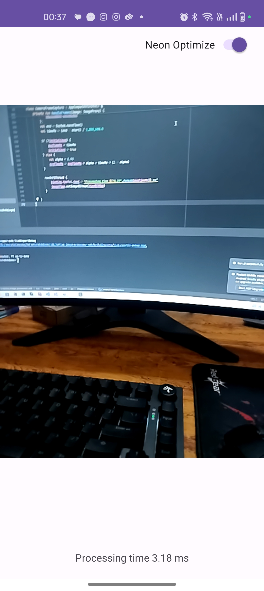
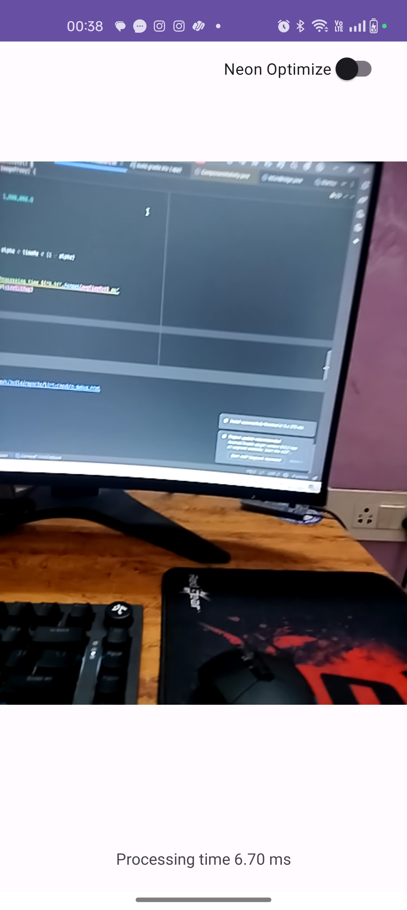
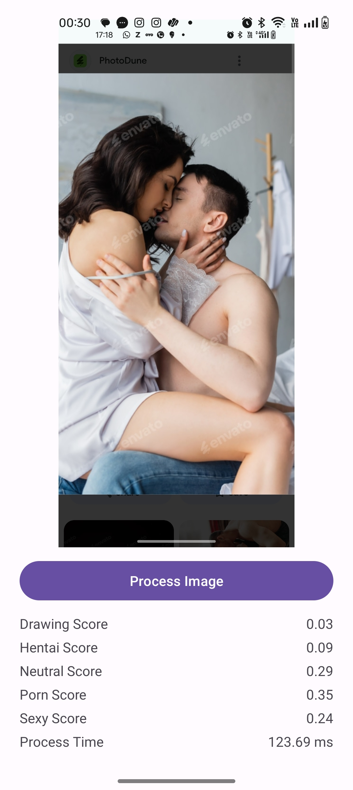

# 📘 Image Processing Demo App (Android)

This repository contains a simple Android app used to test and demonstrate the two SDKs:

- sdk-image-processor (NEON-optimized CPU filters)

- sdk-nsfw-detector (offline NSFW classification)

The app provides a minimal UI to test real-time CameraX processing, NEON vs scalar performance, and model inference output.

## 1. Overview

The app includes:

- CameraX ImageAnalysis pipeline

- YUV_420_888 → RGBA8888 conversion (scalar + NEON)

- Per-frame processing time display

- Basic image filters (gray, blur, sharpen, emboss, edge, negative)

- NSFW classification screen showing all 5 model outputs

- Simple toggles for NEON optimization

The focus is on correctness and performance testing, not UI design.

## 2. Features
### A. CameraX Processing

- Receives YUV frames

- Converts to RGBA

- Applies selected filter (scalar or SIMD)

- Shows processing time in milliseconds

- Updates the preview in real time

### B. CPU Filters (from sdk-image-processor)

- Grayscale

- Negative

- Gaussian Blur (3×3, 5×5, 9×9)

- Sharpen

- Emboss

- Sobel Edge

Each filter has:

- Scalar implementation

- NEON SIMD implementation

### C. NSFW Model

- Native preprocessing

- Tensor preparation (optionally SIMD-optimized)

- TFLite inference

- 5 output classes shown with values

- Processing time displayed

## 3. APK

A debug APK is provided for direct testing:

/demo-debug.apk

Requires:

- ARM64 device with NEON

- Android 8.0 or above

## 4. Screenshots

## 5. Requirements

- Android Studio Ladybug (or newer)

- Android Gradle Plugin compatible with AGP 8+

- ARM64 device

- Camera permission at runtime

## 6. Linked SDKs

Image Processor:
https://github.com/ghimanshu383/sdk-image-processor

NSFW Detector:
https://github.com/ghimanshu383/sdk-nsfw-detector

## 7. Notes

- Scalar timings fluctuate depending on memory bandwidth and CPU frequency.

- NEON timings stay stable on compute-heavy operations.

- No GPU/Vulkan compute is used in this demo (CPU only).

- This project is meant for testing and demonstration, not production UI.

